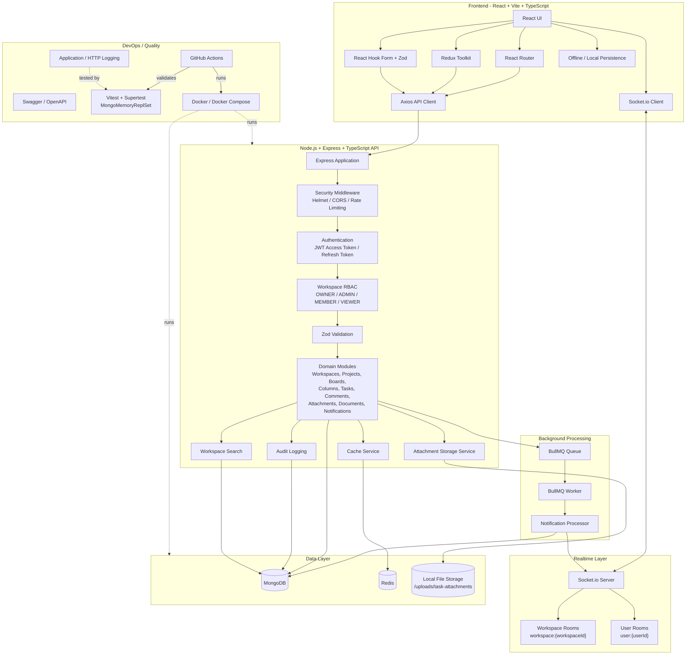

# Architecture

```mermaid
flowchart TD
    subgraph FE["Frontend - React + Vite + TypeScript"]
        RUI[React UI]
        RR[React Router]
        RTK[Redux Toolkit]
        RHF[React Hook Form + Zod]
        SIOC[Socket.io Client]
        OFF[Offline / Local Persistence]
        AXIOS[Axios API Client]

        RUI --> RR
        RUI --> RTK
        RUI --> RHF
        RUI --> SIOC
        RUI --> OFF
        RR --> AXIOS
        RTK --> AXIOS
        RHF --> AXIOS
    end

    subgraph API["Node.js + Express + TypeScript API"]
        EXP[Express Application]
        SEC["Security Middleware<br/>Helmet / CORS / Rate Limiting"]
        AUTH["Authentication<br/>JWT Access Token / Refresh Token"]
        RBAC["Workspace RBAC<br/>OWNER / ADMIN / MEMBER / VIEWER"]
        ZOD[Zod Validation]
        DOM["Domain Modules<br/>Workspaces, Projects, Boards,<br/>Columns, Tasks, Comments,<br/>Attachments, Documents, Notifications"]
        SEARCH[Workspace Search]
        AUDIT[Audit Logging]
        CACHE[Cache Service]
        ATTSVC[Attachment Storage Service]

        EXP --> SEC
        SEC --> AUTH
        AUTH --> RBAC
        RBAC --> ZOD
        ZOD --> DOM
        DOM --> SEARCH
        DOM --> AUDIT
        DOM --> CACHE
        DOM --> ATTSVC
    end

    subgraph BG["Background Processing"]
        BQ[BullMQ Queue]
        BW[BullMQ Worker]
        NP[Notification Processor]

        BQ --> BW
        BW --> NP
    end

    subgraph RT["Realtime Layer"]
        SIOS[Socket.io Server]
        WR["Workspace Rooms<br/>workspace:{workspaceId}"]
        UR["User Rooms<br/>user:{userId}"]

        SIOS --> WR
        SIOS --> UR
    end

    subgraph DEVOPS["DevOps / Quality"]
        GHA[GitHub Actions]
        LOG[Application / HTTP Logging]
        SWAG[Swagger / OpenAPI]
        TEST["Vitest + Supertest<br/>MongoMemoryReplSet"]
        DOCKER[Docker / Docker Compose]

        GHA -- validates --> TEST
        GHA -- runs --> DOCKER
    end

    subgraph DATA["Data Layer"]
        MONGO[("MongoDB")]
        REDIS[("Redis")]
        FILES[("Local File Storage<br/>/uploads/task-attachments")]
    end

    AXIOS --> EXP
    SIOC <--> SIOS

    DOM --> BQ
    NP --> SIOS
    NP --> MONGO

    DOM --> MONGO
    AUDIT --> MONGO
    SEARCH --> MONGO
    CACHE --> REDIS
    ATTSVC --> FILES

    DOCKER -. runs .-> API
    DOCKER -. runs .-> DATA
    LOG -. "tested by" .-> TEST
```
