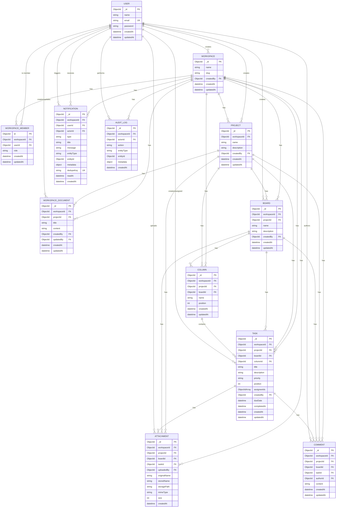

# ER Diagram

```mermaid
erDiagram
    USER ||--o{ WORKSPACE : creates
    USER ||--o{ WORKSPACE_MEMBER : "is member"
    WORKSPACE ||--o{ WORKSPACE_MEMBER : has
    USER ||--o{ PROJECT : creates
    WORKSPACE ||--o{ PROJECT : has
    WORKSPACE ||--o{ NOTIFICATION : has
    USER ||--o{ NOTIFICATION : receives
    USER ||--o{ NOTIFICATION : triggers
    WORKSPACE ||--o{ AUDIT_LOG : has
    USER ||--o{ AUDIT_LOG : performs
    WORKSPACE ||--o{ WORKSPACE_DOCUMENT : has
    PROJECT ||--o{ WORKSPACE_DOCUMENT : has
    USER ||--o{ WORKSPACE_DOCUMENT : "creates/updates"
    WORKSPACE ||--o{ BOARD : has
    PROJECT ||--o{ BOARD : has
    USER ||--o{ BOARD : creates
    WORKSPACE ||--o{ COLUMN : has
    PROJECT ||--o{ COLUMN : has
    BOARD ||--o{ COLUMN : has
    WORKSPACE ||--o{ TASK : has
    PROJECT ||--o{ TASK : has
    BOARD ||--o{ TASK : has
    COLUMN ||--o{ TASK : contains
    USER ||--o{ TASK : "creates/assigned"
    WORKSPACE ||--o{ ATTACHMENT : has
    PROJECT ||--o{ ATTACHMENT : has
    BOARD ||--o{ ATTACHMENT : has
    TASK ||--o{ ATTACHMENT : has
    USER ||--o{ ATTACHMENT : uploads
    WORKSPACE ||--o{ COMMENT : has
    PROJECT ||--o{ COMMENT : has
    BOARD ||--o{ COMMENT : has
    TASK ||--o{ COMMENT : has
    USER ||--o{ COMMENT : authors

    USER {
        ObjectId _id PK
        string name
        string email UK
        string password
        datetime createdAt
        datetime updatedAt
    }

    WORKSPACE {
        ObjectId _id PK
        string name
        string slug
        ObjectId createdBy FK
        datetime createdAt
        datetime updatedAt
    }

    WORKSPACE_MEMBER {
        ObjectId id PK
        ObjectId workspaceId FK
        ObjectId userId FK
        string role
        datetime createdAt
        datetime updatedAt
    }

    PROJECT {
        ObjectId _id PK
        ObjectId workspaceId FK
        string name
        string description
        ObjectId createdBy FK
        datetime createdAt
        datetime updatedAt
    }

    NOTIFICATION {
        ObjectId _id PK
        ObjectId workspaceId FK
        ObjectId userId FK
        ObjectId actorId FK
        string type
        string title
        string message
        string entityType
        ObjectId entityId
        object metadata
        string dedupeKey UK
        datetime readAt
        datetime createdAt
    }

    AUDIT_LOG {
        ObjectId _id PK
        ObjectId workspaceId FK
        ObjectId actorId FK
        string action
        string entityType
        ObjectId entityId
        object metadata
        datetime createdAt
    }

    WORKSPACE_DOCUMENT {
        ObjectId _id PK
        ObjectId workspaceId FK
        ObjectId projectId FK
        string title
        string content
        ObjectId createdBy FK
        ObjectId updatedBy FK
        datetime createdAt
        datetime updatedAt
    }

    BOARD {
        ObjectId _id PK
        ObjectId workspaceId FK
        ObjectId projectId FK
        string name
        string description
        ObjectId createdBy FK
        datetime createdAt
        datetime updatedAt
    }

    COLUMN {
        ObjectId _id PK
        ObjectId workspaceId FK
        ObjectId projectId FK
        ObjectId boardId FK
        string name
        int position
        datetime createdAt
        datetime updatedAt
    }

    TASK {
        ObjectId _id PK
        ObjectId workspaceId FK
        ObjectId projectId FK
        ObjectId boardId FK
        ObjectId columnId FK
        string title
        string description
        string priority
        int position
        ObjectIdArray assigneeIds
        ObjectId createdBy FK
        datetime dueDate
        datetime completedAt
        datetime createdAt
        datetime updatedAt
    }

    ATTACHMENT {
        ObjectId _id PK
        ObjectId workspaceId FK
        ObjectId projectId FK
        ObjectId boardId FK
        ObjectId taskId FK
        ObjectId uploadedBy FK
        string originalName
        string storedName
        string storagePath
        string mimeType
        int size
        datetime createdAt
    }

    COMMENT {
        ObjectId _id PK
        ObjectId workspaceId FK
        ObjectId projectId FK
        ObjectId boardId FK
        ObjectId taskId FK
        ObjectId authorId FK
        string content
        datetime createdAt
        datetime updatedAt
    }
```
